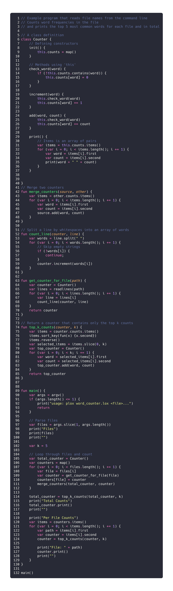

# Plox

Plox is a tree walk interpreter implementation of the Lox language from [https://craftinginterpreters.com/](https://craftinginterpreters.com/), with some more additions that make the language nicer to use.

Here is an example of a word counter utility in the Plox language available in `examples/word_counter/`



Running it:

```shell
$ plox word_counter.lox input1.txt input2.txt
Files
["input1.txt", "input2.txt"]
Total Counts
c 170
a 133
l 113
d 99
b 99
Per File Counts
File: input1.txt
c 60
a 48
l 38
d 34
b 34
File: input2.txt
c 110
a 85
l 75
b 65
d 65
```

## Additional features
- Semicolon inference
- Compound assignments
- Strings, arrays, maps, sets, pairs
